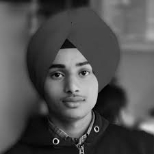

## Harpreet Singh - Portfolio
 

### Personal Information
- **Name:** Harpreet Singh
- **Location:** Dehlon

### Education

#### Senior Secondary Education
- **School:** Government Senior Secondary Smart School, Dehlon
- **Highlights:**
  - Excelled in academic performance, particularly in subjects related to science and mathematics.
  - Participated actively in various school events, showcasing leadership and teamwork skills.
  - Engaged in extracurricular activities, including debates, science fairs, and sports.

#### B.Tech in Computer Science Engineering
- **Institution:** Guru Nanak Dev Engineering College 
- **Branch:** Computer Science Engineering

### Skills
- **Programming Languages:** Little basics in in C, C++, Python, and Java.
- **Web Development:** Little Knowledgeable in HTML, CSS, and JavaScript. 
- **Soft Skills:** Strong analytical and problem-solving abilities, effective communication, and teamwork.
- 
### Future Goals
- **Short-Term Goals:** To secure an internship or job opportunity that allows me to apply my skills and knowledge in a real-world setting, contributing to the success of the organization.
- **Long-Term Goals:** To become a proficient software engineer, continuously learning and growing in the field, and making significant contributions to the advancement of technology.
- **Start-up**
